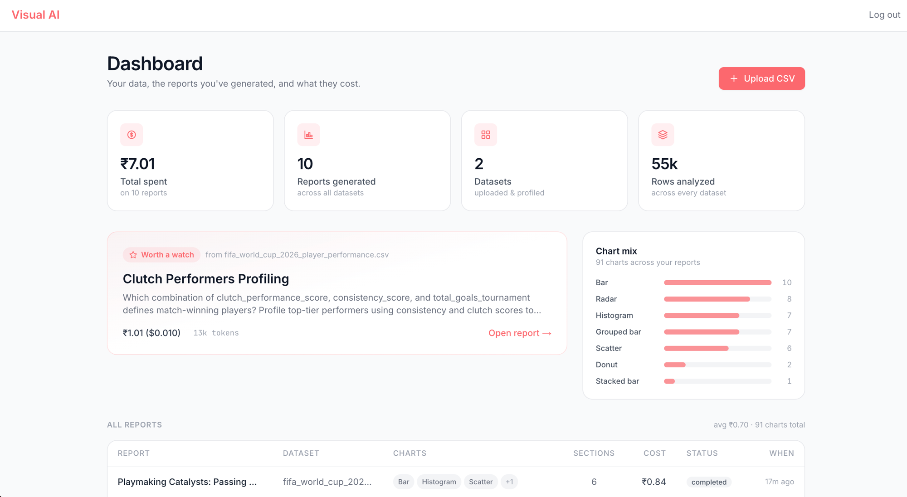
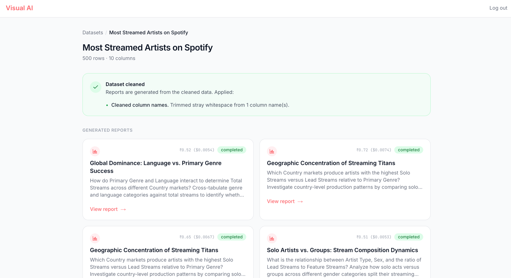
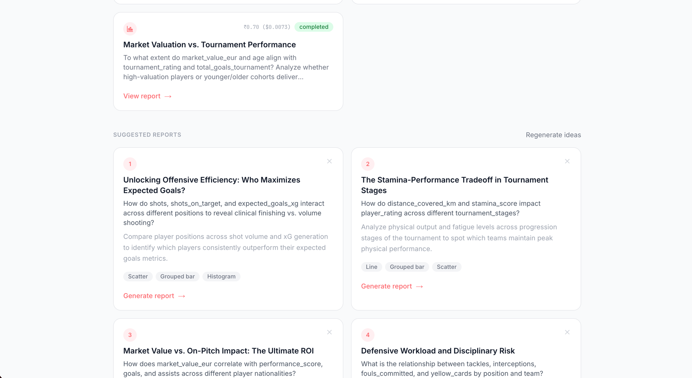
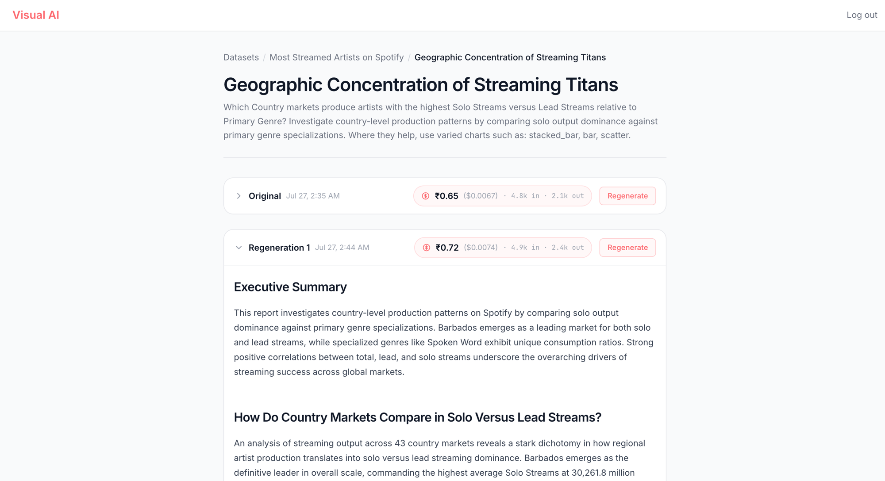
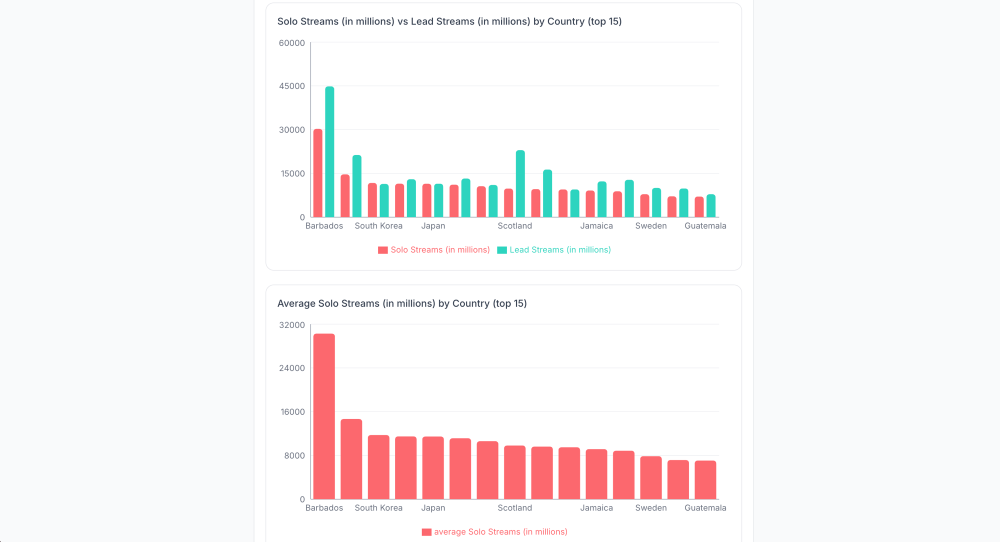

<div align="center">

# Visual AI

### Upload a CSV. Get a polished, chart-backed analytical report — no SQL, no Python, no prompt engineering.

Visual AI reads your data, proposes the highest-value reports worth building, and writes each one as a
multi-section narrative with interactive charts — grounded in exact, Python-computed numbers, and generated
for **fractions of a cent**.

</div>



---

## What it does

You bring a spreadsheet; Visual AI does the analyst's job around it:

1. **Understands your data** on upload — profiles every column, flags data-quality issues, and offers one-click cleaning.
2. **Proposes the reports worth building** — five concrete, multi-column investigations tailored to *your* columns, not generic charts.
3. **Writes the report** — a deterministic analysis engine computes the statistics; the AI selects what matters and writes the narrative. Numbers are exact by construction; charts can't be wrong.
4. **Shows the cost** of every report, down to the token.

The goal: eliminate the need to know Pandas, SQL, or prompt engineering to get a real answer from your data.

---

## Features

| | Feature | What it means for you |
|---|---|---|
| 🧠 | **AI report suggestions** | On analyze, you get 5 tailored investigations ("Which country markets produce the highest solo-vs-lead streamers?") — each a real thesis, not a single chart. |
| 📊 | **Chart-backed reports** | Every report is exec summary → analytical sections → recommendations, each backed by the right chart type (bar, grouped/stacked bar, scatter, line, pie/donut, radar, histogram). |
| 🎯 | **Goal-aware analysis** | The report answers *your* question — it analyzes the columns your goal names (even high-cardinality ones like Country/Genre), not whatever is statistically loudest. |
| ✅ | **Exact numbers, valid charts** | All statistics are computed in Python (DuckDB/Pandas). The AI writes prose and picks charts — it never calculates or invents a value. |
| 🗂️ | **Problem statements & versions** | Every report belongs to one analytical question — a *problem statement*. Regenerate for fresh takes; all versions stack together, newest open, the rest a click away. |
| ⬇️ | **PDF & ZIP export** | Download any report version as a polished PDF (charts included), or a whole problem statement's versions as a single ZIP. |
| 🗄️ | **Archive, never delete** | Datasets and reports are archived (soft-deleted), never destroyed — restore any of them anytime from the archived view. |
| 📋 | **Command-center dashboard** | Total spend, reports generated, rows analyzed, your chart mix, and a "worth a watch" featured report — at a glance. |
| 🧹 | **One-click data cleaning** | Detects messy types, placeholder nulls, duplicate rows, case-variant categories, and empty columns — cleans them non-destructively before reporting. |
| 💸 | **Cost transparency** | Each report shows exactly what it cost to generate (~₹0.5 / **$0.006** per report) and the tokens used. |
| ⚡ | **Live streaming** | Reports stream in section-by-section over SSE, so you watch them build. |

---

## The flow

```
 Upload CSV ─▶ Profile & audit ─▶ [Clean?] ─▶ AI suggests 5 reports ─▶ Generate ─▶ Streamed report
                                                                                    ├─ Executive summary
                                                                                    ├─ Analytical sections + charts
                                                                                    ├─ Recommendations
                                                                                    ├─ Regenerate ─▶ new version (stacked)
                                                                                    └─ Download ─▶ PDF · or ZIP all versions
```

**1 · Upload** — drop any CSV; it's profiled the moment it lands and shows up on your dashboard.

**2 · Analyze** — a cleaning recommendation appears if the data needs it, and generated reports sit alongside fresh AI suggestions.



**3 · Suggested reports** — five tailored investigations, each naming real columns and the chart types that would evidence them.



**4 · The report** — a written analysis with an executive summary, analytical sections, and recommendations. Regenerate to stack alternate takes as collapsible versions.



**5 · Charts that answer the question** — e.g. *Solo vs Lead streams by Country (top 15)* — the exact comparison the goal asked for.



---

## The dashboard

Your command center: total spend, reports generated, rows analyzed, the chart types you use most, and a **"worth a watch"** featured report. Reports are grouped by **problem statement** — a `+N` badge shows how many versions each has — and every row has a download action (a **PDF** for a single report, a **ZIP** when there are multiple versions).


---

## Problem statements, versions & downloads

A **problem statement** is a single analytical question you put to your data — e.g. *"Which country markets produce the highest solo-vs-lead streamers?"* Generate it once, then **regenerate** for a fresh take. Every version stacks under that one question (newest open, the rest collapsed), so you can compare angles instead of losing them.

- **Regenerate** — a new version each time, never overwriting the last.
- **Download a version** — one polished PDF, charts included.
- **Download all** — every version of a problem statement, zipped.
- **Archive, never delete** — datasets and reports are soft-deleted and restorable; an Active/Archived toggle on the dashboard brings anything back.


---

## How it stays this cheap (and accurate)

The core design principle: **the LLM is a writer and a selector — never a calculator or a controller.**

Instead of an agent that loops, deciding which query to run next (expensive, and it re-sends its whole context every step), Visual AI does the reasoning in Python *before spending a token*:

```
 ┌─ Deterministic analysis battery (Pandas / DuckDB) ─ $0 ─┐
 │  correlations · segment & cohort comparisons · top-N    │
 │  leaderboards · A-vs-B by dimension · outliers · trends │──▶ ranked "findings" + ready charts
 └─────────────────────────────────────────────────────────┘
                                │
        ┌───────────────────────┴───────────────────────┐
        ▼                                                ▼
  1 semantic-spec call                          1 plan call
  (what's the entity name? the grain?           (pick & order the goal-relevant
   which groupings are valid?)                   findings, write summary + recs)
                                                         │
                                                         ▼
                                          N streamed section-write calls
                                             (prose only — no tools, no loops)
```

The result: a typical report is **~1–2 orders of magnitude cheaper** than an agent-loop approach (**~$0.006 vs ~$0.13**), *and* higher quality — because the numbers are Python-exact, the charts are always valid, and a cheap semantic step keeps the report grounded in what the data actually means (real names vs id codes, per-entity vs per-event grain, meaningful groupings).

---

## Tech

| Layer | Stack |
|-------|-------|
| Frontend | Next.js 14 (App Router), React 18, TypeScript, Tailwind CSS v3 |
| Charts | Recharts (neutral chart specs compiled server-side) |
| Export | Client-side PDF (jsPDF + SnapDOM chart capture) and ZIP (JSZip) |
| State / data | Redux Toolkit + redux-persist, TanStack React Query v5, axios (Bearer interceptor) |
| Backend | FastAPI, LangGraph + Google **Gemini** (`gemini-3.5-flash-lite`) |
| Compute | **DuckDB** over **Parquet**, Pandas — all statistics run deterministically |
| Storage | PostgreSQL (metadata), local disk / Parquet cache (data) |
| Streaming | Server-Sent Events (`sse-starlette`) |
| Tooling | Turborepo, yarn workspaces, Alembic migrations, Prettier |

---

## Monorepo layout

This is a **Turborepo** monorepo managed with **yarn workspaces**.

```
visual-ai/
├── apps/
│   ├── api/     # FastAPI + Gemini backend (Python)   — see apps/api/README.md
│   │   └── app/agent/analysis.py   # the deterministic analysis battery
│   │       app/agent/report.py     # spec → plan → streamed section writes
│   │       app/services/preprocessing.py  # report-appropriate data cleaning
│   └── web/     # Next.js 14 frontend (TypeScript)
│       └── app/dashboard/          # command-center dashboard
│           app/reports/[reportId]/ # streamed report + versions + downloads
│           utils/reportPdf.tsx     # client-side PDF / ZIP export
├── docs/screenshots/
├── turbo.json
└── package.json
```

---

## Getting started

**Prerequisites:** Node **>= 22** (`.nvmrc` → 22) + Yarn 1.x (`corepack enable`), Python 3.12+, Docker, and a **Google Gemini API key**.

```bash
# 1. Install JS deps for all workspaces
corepack enable
yarn install

# 2. Backend: Python env + database
cd apps/api
python3 -m venv .venv && .venv/bin/python -m pip install -r requirements.txt
cp .env.example .env            # set GOOGLE_API_KEY + SECRET_KEY
cd ../.. && docker compose up -d db
cd apps/api && .venv/bin/alembic upgrade head && cd ../..

# 3. Frontend env
cp apps/web/.env.example apps/web/.env.local   # set NEXT_PUBLIC_BASE_API_URL

# 4. Run everything (turbo runs api + web together)
yarn dev
# web → http://localhost:3000    api → http://localhost:8000
```

Then open **http://localhost:3000**, register, upload a CSV, and hit **Analyze**.

---

## Common commands

```bash
yarn dev            # turbo run dev  (all apps)
yarn build          # turbo run build
yarn lint           # turbo run lint
yarn test           # turbo run test
yarn workspace @visual-ai/web dev     # run a single workspace
yarn workspace @visual-ai/api test
```

See [`apps/api/README.md`](apps/api/README.md) for the full backend docs and API reference.
